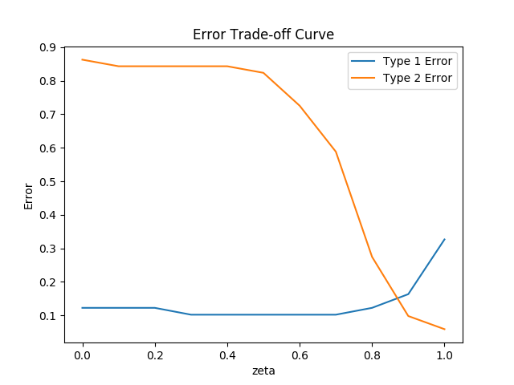

# bayesian-spam-filter
A Naive Bayes Classifier for Spam Filtering.

The filter operates at an optimal error-ratio of misclassified
spam emails as ham and ham emails as spam.

At this ratio, it correctly classifies 42 out of 49 spam emails and 44 out of 51 ham emails
in the testing dataset. The error trade-off curve can be seen below:

