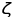

# bayesian-spam-filter

For every word, , a smoothed estimate of its probability of appearing in either email class (spam or ham), 
, is calculated by iterating over the training files in `data/spam/` and  `data/ham/`.

The probability of an email belonging to either class can be calculated using Bayes' rule as . 

We can express the probability of the email appearing in a particular class as , where  is the frequency of the word  in the given email. 

To classify the email as by picking the the class which has a higher probability than the other. For spam, this will happen when
.

Since we are less tolerant of spam, the filter needs to lower the "threshold" to classify an email as spam. Therefore, we introduce a decision factor, , that takes a value ranging from
0 to 1. We can now classify the email as spam if  and ham otherwise. 
To evaluate performance of the filter over different values of , we define the following errors,   
 - Type 1 error: fraction of spam emails misclassified as ham
 - Type 2 error: fraction of of ham emails misclassified as spam

The error trade-off curve can be seen below:

The optimal value of the decision factor is when both error curves meet and are sufficiently low, which happens at  = 0.88. At this value, the filter correctly classifies 42 out of 49 spam emails and 44 out of 51 ham emails in the testing dataset which can be found in `data/testing/`.
